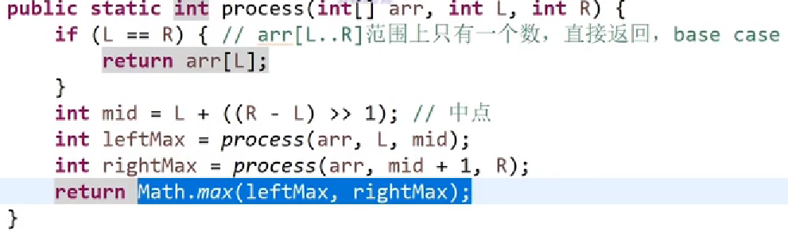
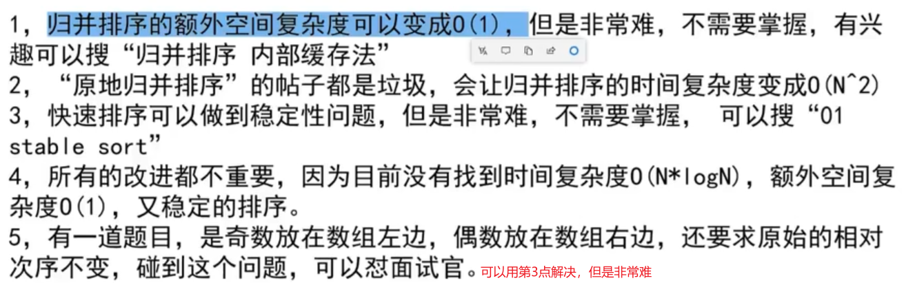
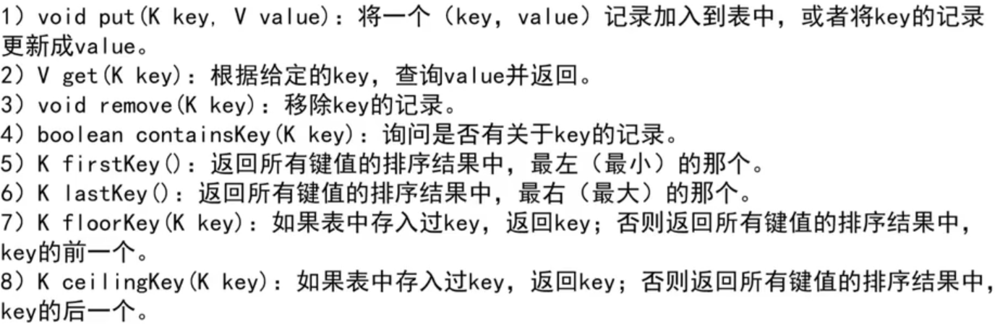

# 数据结构与算法

## 基础知识

> 算法可视化：https://visualgo.net/zh

### 复杂度

> 时间复杂度

简单理解：本次操作中常数操作的总时间

- 常数操作：和**数据量无关**，是一个**固定时间**的操作，例如 数组寻址/加减乘除等等

举个栗子：(选择排序)实现数组从小到大排序，步骤-每次选择一个最小的按顺序从左到右放

1. 设有一个 N-1 长度的数组; 第一次排序需进行**查找 N 个元素，比较 N-1 次，进行 1 次交换**得常数操作

2. 第二次排序，由于第一个元素确定了(最小的)，就从下标为 1 的元素开始比较(以此类推); 由此可得第二个元素需要进行 **查找 N - 1 个元素，比较 N -2 次，进行 1 次交换** 的常数操作

3. 第三次排序，同理，第三个元素需要进行 **查找 N - 2 个元素，比较 N - 3 次，进行 1 次交换** 的常数操作

4. .... 最终会进行 **查找 (N) + (N - 1) + (N - 2) ..... (1)，比较 (N-1) + (N - 2) + (N - 3) ..... (1)，进行 N 次交换 ** 的常数操作

5. 将三个式子的结果接起来，通过[等差数列](https://www.bilibili.com/video/BV1Bs411573j?spm_id_from=333.337.search-card.all.click)可得最终的**常数操作数量**为：
   $$
   aN^2 + bN + C
   $$

6. 此时到了最重要的一步：**化简！！！**

   - 去掉低阶项，只要最高阶的项，上面的式子可以得到
     $$
     aN ^ 2
     $$

   - 忽略高阶项的系数
     $$
     N ^ 2
     $$

7. 最终 **选择排序** 的 **时间复杂度** 为
   $$
   O(N ^ 2)
   $$

> 空间复杂度

当前算法需要开辟的额外空间; 例如：

- 当你进行**选择/冒泡排序**时，本身就是对数组进行操作的，并不需要开辟额外空间，此时空间复杂度为 **O(1)**; 

- 而当我们的算法需要开辟一个额外的数组，并且需要在数组存放 N 个数据时，当前算法的空间复杂度为 **O(N)**

### 算法好坏的指标

1. 判断一个算法的好坏，优先看它的**时间复杂度**，一般越小越好，表示在遇到大数据量的情况下时，该算法所消耗的时间更少
2. 如果两个算法的时间复杂度相同，就需要观察它们的**常数项**，但注意 - 常数项表示的是常数操作，但不同类型的常数操作消耗的时间是不同的(例如一个进行了 10 次乘法运算，一个进行了 100 次位运算); 一般这种情况下就是**上代码**分析不同数据样本下的实际运行时间，这种测试又称为**常数项时间**

### 选择排序

思想：每遍历一次就找到当前剩下数组元素中**最小的元素**，依次放到**最左边**，实现一个**从小到大的排序**

代码：

```java
/**
* 选择排序
* 时间复杂度：使用了两个 for 循环，遍历 n ^ 2 次元素(一次用来找一次用来比较)，也就是 O(n ^ 2)
* 空间复杂度：没有消耗额外的空间(变量 i, minIndex, k 并不影响可以忽略，并没有开辟额外空间分配新的数组)，所以是 O(1)
*/
public static void selectionSort(int[] arr) {
    // 开启遍历，这个外层每遍历一次就会确定一个数
    for (int i = 0; i < arr.length - 1; i++) {
        // 创建一个变量，用来保存最小元素的下标，方便交换; 同时假设当前遍历的元素就是最小的元素
        int minIndex = i;
        // 与后面的元素对比，因为是从左往右排序的所以前面的不用管
        for (int k = i + 1; k < arr.length; k++) {
            // 如果当前元素比正在 遍历的元素大(arr[k]) 就代表 arr[k] 小，那么记录 k 的下标
            minIndex = arr[minIndex] > arr[k] ? k : minIndex;
        }
        // 交换两个元素
        swap(arr, i, minIndex);
    }
    System.out.println(Arrays.toString(arr));
}
/**
* 交换操作
*/
private static void swap(int[] arr, int i, int k) {
    int temp = arr[i];
    arr[i] = arr[k];
    arr[k] = temp;
}
```

### 冒泡排序

思想：

- 从数组的第 1 个元素出发，与右边的元素对比(第 1 和第 2 个元素对比，第 2 个与第 3 个元素对比依次类推)，
- 只要**左边的元素比右边的元素大，就互换位置**，每遍历一次，就能**确定一个最大数**，放在**数组最右边**(因为大的数字一直在往右边移动)，最后实现一个**从小到大的排序的数组**

代码：

```java
/**
* 冒泡排序
* 时间复杂度：O(n ^ 2)
* 空间复杂度：O(1)
* @param arr
*/
public static void bubbleSort(int[] arr) {
    // 因为先确定最右边的元素，所以从最右边开启遍历
    for (int i = arr.length - 1; i > 0; i--) {
        // 从第一个元素开始，遍历到已经确定的元素前即可(最大的先确定，依次放到最右)
        for (int j = 0; j < i; j++) {
            // 比较两个元素，如果右边大，就让它和左边换
            if (arr[j] > arr[j + 1]){
                swap(arr, j , j+1);
            }
        }
    }
    System.out.println(Arrays.toString(arr));
}
```

### 插入排序

思想：

- 从左到右依次遍历数组元素，每遍历一次，就要保证从 0 开始到当前位置是有序的

- 例如：

  - 遍历到第 1 个元素时需要和第 0 个元素进行判断，如果 arr[1] < arr[0] 就交换顺序，由于到最左边了，所以遍历下一个元素; 

  - 第 2 元素需要和前面一个元素也就是第 1 个元素进行判断，
    - 如果 arr[2] > arr[1] 就代表是有序的就可以遍历下一个元素了
    - 但如果 arr[2] < arr[1] 就交换顺序
    - 此时由于没有达到最左边，所以还需要判断 arr[2] 是否大于 arr[0]，如果小于就交换，大于就停止，遍历下一个元素

> 该算法很特殊：元素的会影响遍历次数，例如 [1, 2, 3, 4] 这个数组使用遍历一次数组元素即可O(N),但选择和冒泡不同，它们不会受元素的影响依然是 O(N ^ 2)
>
> 最好情况下时间复杂度为 O(N) 
>
> 最坏情况下时间复杂度为 O(N ^ 2)
>
> 但这里的算法**只考虑最坏情况**，所以该算法的时间复杂度为 o(N ^ 2) 

代码：

```java
public static void insertionSort(int[] arr) {
    for (int i = 1; i < arr.length; i++) {
        // arr[j] > arr[j + 1]: 如果前一个元素大于当前元素才进行交换，但又因为前面的元素已经是排好序的了，所以如果当前元素大于前一个元素时就没必要遍历了，因为 arr[j] 一定大于 arr[j - n]
        for (int j = i - 1; j >= 0 && arr[j] > arr[j + 1]; j--) {
            swap(arr, j, j + 1);
        }
    }
}
```

### 二分查找

思想：

- 在**数组有序**的情况下，可以将数组从中间划开分为两个数组，然后将要查找的元素与中间元素对比，如果比它小就往左边数组找，比它大就往右边找(相同返回即可)；在左/右边查找时也是先从中间划分开左右两个数组然后进行上述查找
- 对于**无序数组**的情况下，针对特定的**数据状况 / 问题标准**也可以用二分查找; 例如：求数组局部最小

代码：

### 计算递归行为的时间复杂度

> 当**子问题的问题规模相同**时，我们就可以使用`master`公式来估算该递归问题的时间复杂度。

首先需要判断当前递归算法是否符合 master 公式
$$
master = a * T(\frac{N}{b}) + O(N^d)
$$
其中 N 为该函数的总数据量，a 为调用了几次子递归，b 为子递归的规格，O(N ^ d) 为出去递归外的常数操作



图中的算法符合 master 规范，即 **a 为 2，b 为 2，d 为 0** 可得：
$$
master = 2 * T(\frac{N}{2}) + O(1)\\
log_ba < d 时，时间复杂度为：O(N ^ d)\\
log_ba > d 时，时间复杂度为：O(N ^ {log_ba})\\
log_ba = d 时，时间复杂度为：O(N ^ d * log_2N)
$$

### 归并排序

思路：

- 先使每个子序列有序，再使子序列段间有序。 若将两个有序表合并成一个有序表，也可以称为二路归并
- 如何将两个有序表合并成一个有序表？
  1. 创建一个空数组 temp 暂时保存有序的数据
  2. 依次遍历两个有序集合，定义两个索引，依次遍历对比，只有元素小的数据才能先放到 temp 中然后对应的索引才可以 ++，直到将其中一个有序集合全部遍历
  3. 将剩下的那个有序集合中剩下的元素直接保存到 temp 中
  4. 将 temp 中的元素按一定顺序拷贝到原数组中

代码：

```java
/**
* 归并排序：
* 时间复杂度：O(N *  logN)
* 空间复杂度：O(N)
* @param arr
*/
public static void mergeSort(int[] arr, int l, int r) {
    // 如果 l == r 就直接返回
    if (l == r) {
        return;
    }
    // 获取中位数
    int mid = l + ((r - l) >> 1);
    // 先使左右两个子序列有序
    mergeSort(arr, l, mid);
    mergeSort(arr, mid + 1, r);
    // 使子序列段间
    merge(arr, l, mid, r);
}

/**
* 归并排序的核心：将两个有序的子序列的合并成一个有序的子序列段
* @param arr
* @param l
* @param m
* @param r
*/
private static void merge(int[] arr, int l, int m, int r) {
    // 初始化辅助空间
    int[] tempArr = new int[r - l + 1];
    /*
    * 定义两个下标，依次从左往右比较两个数组中的元素，哪个小就放到 tempArr 中，然后对应的索引就 +1
    * */
    int tempIdx = 0;
    int lIdx = l;
    int rIdx = m + 1;
    while (lIdx <= m && rIdx <= r) {
        tempArr[tempIdx++] = arr[lIdx] < arr[rIdx] ? arr[lIdx++] : arr[rIdx++];
    }
    while (lIdx <= m) {
        tempArr[tempIdx++] = arr[lIdx++];
    }
    while (rIdx <= r) {
        tempArr[tempIdx++] = arr[rIdx++];
    }
    // 最后将 tempArr 的元素拷贝给 arr 即可
    for (int i = 0; i < tempArr.length; i++ ) {
        arr[l + i] = tempArr[i];
    }
}
```

### 快速排序

思想：

- 快排分为三个版本，但原理都差不多
- 主要步骤：
  1. **先从数组中选择一个数 num**，如何将数组划分成左边是**小于等于 num 的数**，而右边是**大于 num 的数**
  2. 然后再将左边和右边的数组(不包括 num)放到递归中重复以上操作
- 版本区别
  - 1.0 版本就是主要步骤中所描述的，时间复杂度为 O(N ^ 2)
  - 2.0 版本是将 数组左边只保存小于 num 的数，中间放等于 num 的数，右边是大于 num 的数；递归时数组中间并不参与，时间复杂度为 O(N ^ 2)
  - 3.0 版本是在 2.0 的版本的基础上，改变了选择了 num 的方式；此前 1/2 版本中都是选择最左边的数作为 num，而 3 版本是**随机选择**的; 时间复杂度为 O(N * logN)

代码：

```java
/**
* 快速排序(v3)：
* 时间复杂度：O(N * logN)
* 空间复杂度：
*  - 最好：O(logN)
*  - 最坏：O(N)
* @param arr
* @param l
* @param r
*/
public static void quickerSort(int[] arr, int l, int r) {
    if (l < r) {
        // 随机选择一个下标的元素作为 num
        int numIdx = l +  (int) (Math.random() * (r - l + 1));
        // 将 numIdx 下标的元素放到数组最左边方便计算
        swap(arr, numIdx, r);
        // 由 partition 函数决定左右两个数组的边界，并保证中间数据和 numIdx 下标的数据相同
        int[] p = partition(arr, l , r);
        // p 中保存了两个元素，方便对应的中间数组(等于num)的两个边界
        quickerSort(arr, l, p[0] - 1);
        quickerSort(arr, p[1] + 1, r);
    };
}

private static int[] partition(int[] arr, int l, int r) {
    // less 表示左区域(比 num 小)边界的下一个数，也就是中间区域的最左边
    int less = l;
    // more 表示右区域(比 num 大)边界的前一个数，也就是中间区域的最右边
    int more = r - 1;
    // i 指向需要判断的数据的下标
    int i = l;
    // 当判断的数据已经到了右边区域内部时就不用判断了
    while (i <= more) {
        if (arr[i] < arr[r]) {
            // 如果当前数据比 num 小，就放到左区域，并把它的 边界++ => 也就是 less++
            swap(arr, i++, less++);
        } else if(arr[i] > arr[r]) {
            // 如果当先数据比 num 大，就放到右区域，并把它的 边界-- => 也就是 more--
            // 注意，这里 i 不要 ++，因为换过来的数是右区域(比 num 大)边界的前一个数，并不是右区域内部的数，即还未判断的数
            swap(arr, more--, i);
        } else {
            // 如果相同就代表是中间区域的，判断下一个数据即可
            i++;
        }
    }
    // 最后 i > more，i 处于右区域的左边界，所以让它和 num 下标 r 进行一个交换
    /*        less more
    * [1,  2,  3 ,  3,  7 , 5 , 3]
    *                   i       r
    * 交换之后
    *        less  more
    * [1,  2,  3 ,  3,  3 , 5 , 7]
    *                   i       r
    * */
    swap(arr, i, r);
    // 返回边界，这里的 i 也可以换成 more + 1
    return new int[]{less, i};
}
```


### 堆

> 堆结构

- 从逻辑上可以理解为堆是一颗 **完全二叉树**(不懂得可以百度下，很简单理解di)

- 可以用一个数组连续的 heapSize 个元素表示堆(完全二叉树)

  ```
  在这连续的 heapSize 个元素中，每个元素都满足一下规律
  父元素   == i / 2 - 1
  左子元素 == i * 2 + 1
  右子元素 == i * 2 + 2
  ```

- 分类

  - 大根堆：在完全二叉树种，以 任意一个节点 作为 头节点 都是 **对应子树的最大值**
  - 小根堆：在完全二叉树种，以 任意一个节点 作为 头节点 都是 **对应子树的最小值**

> 堆结构相关算法的核心

- `heapInsert`：将数组变成一个大根堆

  让元素和它的父元素进行对比，如果比它大就交换到上一层去

  ```java
  /**
  * heapInsert 调整数组中的元素，使其符合大根堆的规则
  * @param arr
  * @param index
  */
  private static void heapInsert(int[] arr, int index) {
      while (arr[index] > arr[(index - 1) / 2]){
          swap(arr, index, (index - 1) / 2);
          index = (index - 1) / 2;
      }
  }
  ```

- `heapify`: 重新调整数组结构,保证其符合堆的特点

  从 index 开始调整子树让其符合大根堆的结构

  ```java
  /**
  * heapIfy 从 index 开始重新调整大根堆的结构
  * @param arr
  * @param index
  * @param heapSize
  */
  private static void heapIfy(int[] arr, int index, int heapSize) {
      int left = index * 2 + 1;
      // 保证操作的元素是在大根堆中的
      while (left < heapSize) {
          // 求出两个子元素的之间的最大值
          int largest  = left + 1 < heapSize && arr[left] < arr[left + 1] ? left + 1 : left;
          // 与当前元素进行一个对比
          if (arr[index] >= arr[largest]) {
              // 如果当前元素符合大根堆的结构就不需要调整
              break;
          }
          swap(arr, index, largest);
          index = largest;
          left = index * 2 + 1;
      }
  }
  ```

> 堆排序

思想：

- 先将数组调整至大根堆的结构(heapInsert)
- 将数组的第一个元素和 heapSize 的最后一个元素交换，然后 `heapSize--`(表示数组中从0开始一共有几个元素是堆结构)，然后对第一个元素进行 `heapIfy` 操作，依次类推，直到 heapSize == 0

代码：

```java
/**
* 堆排序：
* 时间复杂度：O(N * logN)
*  注意：在堆排序中的 1. 无论使用 1.2 / 1.1 都不影响堆排序的时间复杂度，因为最后都会进行一个 O(N * logN) 的运算
*       但如果只要求将一个数组变成一个大根堆，推荐使用 1.2 heapIfy
* 空间复杂度：O(1)
*
* @param arr
*/
public static void heapSort(int[] arr) {
    int heapSize = 0;
    // 1. 将数组变成一个大根堆
    // 1.1 方法一：通过 heapInsert; 时间复杂度：O(N * logN)
    //        for (int i = 0; i < arr.length; i++) {
    //            heapInsert(arr, i);
    //        }
    //         1.2 方法二：通过 heapIfy; 时间复杂度：O(N)
    for (int j = arr.length; j >= 0; j--) {
        heapIfy(arr, j, arr.length);
    }
    heapSize = arr.length;

    // 2. 将数组中 heapSize 的最后一个元素和第一个元素交换
    // 时间复杂度：O(N)
    while (heapSize > 0) {
        // O(1)
        swap(arr, 0, heapSize - 1);
        // O(logN)
        heapIfy(arr, 0, --heapSize);
    }
}
```

> 注意

1. 优先级队列的底层就是堆结构，例如 Java 中的 **PriorityQueue\<Integer>**(小根堆)
2. 由于堆使用的数组，可能会存在**扩容**问题，但一般影响不大，扩展的时间复杂度为 **O(logN)**
3. 如果是使用系统提供的优先级队列，如果只需要进行**存储获取**(保存一个数，获取一个数)的操作可以使用，但如果**想可以随意的修改堆中的数据，建议手写堆结构**

### 计数排序和基数排序

> 与上述的所有排序(选择，冒泡，插入，归并，快速，堆)都不同，它们都是基于比较的排序(计数和基数不是)

计数排序：

- 时间复杂度：O(N)；空间复杂度：O(N)
- 特点：
  1. 输入的数据必须是有确定范围的整数
  2. 计数排序只能用在**数据范围不大的场景**中，如果数据范围 k 比要排序的数据 n 大很多，就不适合用计数排序了。而且，计数排序只能给非负整数排序，如果要排序的数据是其他类型的，要将其在不改变相对大小的情况下，转化为非负整数。
- 主要思想：使用一个额外数组，该数组负责记录对应下标的数据出现的次数(例如数据为 17 那么额外数组下标为 17 的元素就 + 1)，通过这个次数，我们就可以知道元素在有序数组中的位置

基数排序(又称为**桶排序**)：

- 时间复杂度：O(N); 空间复杂度：O(N + m)

- 特点：

  1. 需要分割出独立的"位"来比较，而且位之间可以进行比较。
  2. 每一位的数据范围不能太大，要可以用线性排序算法来排序，否则，基数排序的时间复杂度就无法做到 O(n)。
  3. 如果排序的元素位数不一样，位数不够的可以在后面补位。

- 主要思想：根据每个数的各个位数进行排序。先根据个位数排序，再根据十位数排序，以此类推，最后根据最高位。

- 代码：

  ```java
  /**
   * 基数排序
   *
   * @param arr
   */
  public static void radixSort(int[] arr, int maxBits) {
      // 表示桶的个数
      final int radix = 10;
  
      // 进行 maxBits 次出入桶操作
      for (int i = 1; i <= maxBits; i++) {
          int[] count = new int[radix];
          // 标记不同数据在同一"位"上的个数并记录起来
          for (int num : arr) {
              // 求出当前 arr[j] 从左到右的第 i 位上的数据
              int digit = getDigit(num, i);
              // 对应的标记的数量++
              count[digit]++;
          }
          /*
               * 从左到右左前缀相加
               * */
          for (int k = 1; k < count.length; k++) {
              count[k] += count[k - 1];
          }
          /*
               * 从左到右到依次将桶里的数据"倒出来"
               * */
          int[] temp = new int[arr.length];
          for (int a = arr.length - 1; a >= 0; a--) {
              // 求出当前 arr[j] 从左到右的第 i 位上的数据
              int digit = getDigit(arr[a], i);
              // 将桶里的数据"倒出来"保存到 temp 数组中
              temp[count[digit] - 1] = arr[a];
              count[digit]--;
          }
          // 将出桶数据保存到 arr 中
          System.arraycopy(temp, 0, arr, 0, temp.length);
      }
  }
  
  /**
   * 求出数组中元素的最大“位”数
   *
   * @param arr
   * @return
   */
  private static int maxBits(int[] arr) {
      int max = Integer.MIN_VALUE;
      for (int i = 0; i < arr.length; i++) {
          max = Math.max(max, arr[i]);
      }
      int res = 0;
      while (max != 0) {
          res++;
          // 每除于10就表示有1位；res++
          max /= 10;
      }
      return res;
  }
  
  /**
   * 获取 x 从左到右的第 d 位数
   *
   * @param x
   * @param d
   * @return
   */
  private static int getDigit(int x, int d) {
      return ((x / (int) Math.pow(10, d - 1))) % 10;
  }
  ```


### 排序算法总结

|              | 时间复杂度  | 空间复杂度 | 稳定性 |
| :----------- | :---------- | ---------- | ------ |
| 选择排序     | O(N ^ 2)    | O(1)       | ×      |
| 冒泡排序     | O(N ^ 2)    | O(1)       | √      |
| 插入排序     | O(N ^ 2)    | O(1)       | √      |
| 快速排序(v3) | O(N ^ logN) | O(logN)    | ×      |
| 归并排序     | O(N ^ logN) | O(N)       | √      |
| 堆排序       | O(N ^ logN) | O(1)       | ×      |

注意：



1. 常数项时间最低的分别是 **插入排序** & **快速排序**

2. 对应算法的选择需要充分利用 O(N ^ logN) 和 O(N ^ 2) 排序各自的优势

   也可以使用综合排序，将两种算法合起来一起使用，例如在使用 快速排序 的过程中，对于一些样本数量(需要排序的数据数量)较小的情况可以使用 插入排序，因为样本数量比较小，需要算法瓶颈的可能性是很低的，而插入排序的并不需要使用额外空间复杂度且常数项时间极低

   ```java
   public static void quickerSort(int[] arr, int l, int r) {
       if (l < r) {
   
           if (r - l > 60) {
               // 可以在样本数量小于 60 时使用快速排序
               quickerSort(arr, l, r);
               return;
           }
   
           // 随机选择一个下标的元素作为 num
           int numIdx = l + (int) (Math.random() * (r - l + 1));
           // 将 numIdx 下标的元素放到数组最左边方便计算
           swap(arr, numIdx, r);
           // 由 partition 函数决定左右两个数组的边界，并保证中间数据和 numIdx 下标的数据相同
           int[] p = partition(arr, l, r);
           // p 中保存了两个元素，方便对应的中间数组(等于num)的两个边界
           quickerSort(arr, l, p[0] - 1);
           quickerSort(arr, p[1] + 1, r);
   
       }
   }
   ```

   在整个数组的排序调度上依然使用快速排序，但在递归一些样本量较小的数据时就可以使用快速排序，减小空间复杂度且影响不大

3. 对应的基础类型的数据可以不考虑稳定性，但对于其他类型就需要根据业务情况而定

### 哈希表

- 在使用层面上可以理解为一种集合结构

- 如果只有 key，没有伴随数据 value，可以使用 HashSet 结构

- 如果既有 key，又有伴随数据 value，可以使用 HashMap 结构

  注意：HashMap 和 HashSet 唯一的区别就在于是否有伴随数据，底层结构是一样的

- 哈希表的 crud 操作可以任务**时间复杂度都是 O(1)**，但是常数时间比较大

- 放入哈希表的数据，如果是基础类型，内部按值传递，内存占用就是这个东西的大小

- 放入哈希表的数据，如果不是基础类型，内部按引用传递，内存占用就是这个东西的内存地址

### 有序表

- 在使用层面上可以理解为一种集合结构

- 如果只有 key，没有伴随数据 value，可以使用 TreeSet 结构

  如果既有 key，又有伴随数据 value，可以使用 TreeMap 结构

  注意：TreeSet 和 TreeMap 的唯一区别在于是否有伴随数据，底层结构是一样的

- 有序表和哈希表的区别在于，有序表会把 key 按照顺序组织起来，而哈希表不组织

- 红黑树，AVL 树，size-balance-tree 和 跳表 都属于有序表数据结构，只是底层具体实现不同

- 放入有序表的数据，如果是基础类型，内部按值传递，内存占用就是这个东西的大小

- 放入有序表的数据，如果不是基础类型，就必须提供比较器，内部按引用传递，内存占用就是这个东西的内存地址

- 只要是有序表，都有一下固定的基本操作和固定的 **时间复杂度 O(logN)**

  

## 解题技巧

### 异或运算的性质与扩展

异或运算：N ^ N = 0; N ^ 0 = N

性质：

- 满足交换律和结合律

- 可以不用额外变量交换两个数(交换的两个数据不能是内存地址相同的，否则两个数据都会变成 0)

  ```java
  arr[i] = arr[i] ^ arr[j]; // a = a^b; b=b
  arr[j] = arr[i] ^ arr[j]; // a = a^b; b = a^b^b => a ^ 0 = a
  arr[i] = arr[i] ^ arr[j]; // a = a^b^a => b^0 = b; b =a
  ```

### 对数器

作用：

- 对于有一些题目，如果是在线上 OJ 测试一把只会给几个简单的 smaples，但有可能我们的算法虽然能处理一些简单的 samples，但遇到复杂的 samples 可能又会出现问题；
- 这个时候我们为题目编写两套算法，一套是我们精心设计的算法，另一套可能是暴力解法等等；这时再通过**对数器生成大量的随机样例并同时调用这两个算法**，对比结果；
- 对数器中，我们要求的绝对正确的算法是没有时间和空间复杂度的限制的，唯一的要求是确保绝对正确。因为只有绝对正确，我们才能通过样例的比对，发现我们的代码是在哪里出了错误

实现：

```java
//生成一个随机的但是可控的数组
public static int[] generateRandomArray(int size, int value)
{
    //Math.random() -> double [0,1)
    //(int) ((size + 1) * Math.random()) -> [0,size]整数
    // 生成长度随机[0, size]的数组
    int[] arr = new int[(int) ((size+1) * Math.random())];
    for (int i = 0; i < arr.length; i++)
    {
        // 一个随机数减去另一个随机数，生成[-value, value]的随机数
        arr[i] = (int) ((value+1) * Math.random()) - (int) (value * Math.random());
    }
    return arr;
}
```

```java
// 判断两个数组是否相等
public static boolean isEqual(int[] arr1, int[] arr2)
{
    if ((arr1 == null && arr2 != null) || (arr1 != null && arr2 == null))
        return false;
    if (arr1 == null && arr2 == null)
        return true;
    if (arr1.length != arr2.length)
        return  false;
    for (int i = 0; i < arr1.length; i++)
    {
        if (arr1[i] != arr2[i])
            return false;
    }
    return true;
}
```

### 比较器

使用：

1. 比较器的实质就是重载比较运算符
2. 可以用在需要按照特殊排序规则的 算法/结构 上

java 实现：

```java
/**
 * 比较器：可以通过按照特定规则进行排序
 * @author 23911
 * @version 1.0
 * @date 2022/3/25 16:19
 */
public class Comparators implements Comparator<Integer> {

    /**
     * 比较两个参数的方法
     *  规则：
     *      当返回值 < 0 时，o1 在前面，o2 在后面
     *      当返回值 > 0 时，o1 在后面，o2 在前面
     *      当返回值 = 0 时，都可以
     *  技巧：
     *      降序：{@code return o1 - o2}
     *      升序：{@code return o2 - o1}
     * @author 23911
     * @date 2022/3/25 16:21
     */
    @Override
    public int compare(Integer o1, Integer o2) {
        return o2 - o1;
    }

}
```

注意：`compare` 方法的两个参数类型是根据实现 **Comparator** 接口时定义的泛型而定的

### 求中位数

- 一般的写法：mid = (l + r) / 2

  - 存在问题：l + r 可能会导致 **整型溢出**，当然了也只有 R / L 特别的情况下才有可能发现

- 更好的写法: mid = l + ((r - l) / 2)

  因为用的是减法，不会导致 **整型溢出**

- 究极简化版：mid = l + ((r - l) >> 1)

### 链表题目的相关技巧

解题技巧：

1. 额外数据结构记录(哈希表等)
2. 快慢指针

面试时链表解题的方法论

- 针对**笔试**，使用时间复杂度低的算法即可，不用太在于空间复杂度
- 针对**面试**，在保证时间复杂度低的同时，尽量减小空间复杂度

